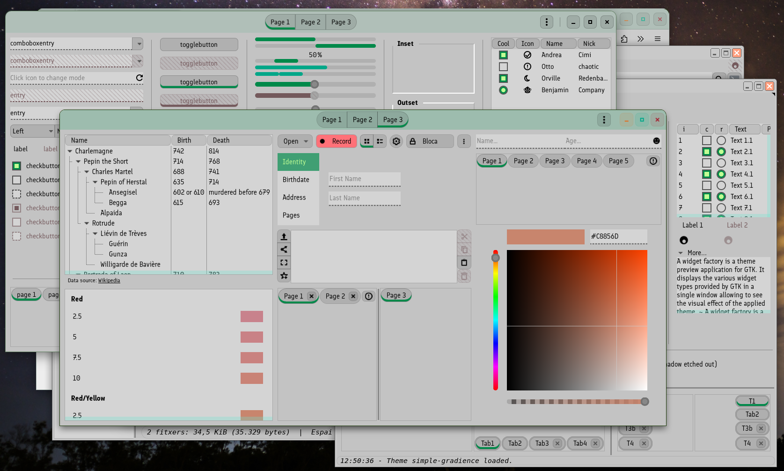

# Simple gradience

This is a very simple and lightweight pure CSS theme (no SASS), which works with color CSS files generated by [Gradience](https://github.com/GradienceTeam/Gradience).
It is still a **work in progress**. The idea is to develop it well enough so it can work with most of gtk3, gtk4 and libadwaita apps, but keeping its code fairly simple. Also, as with the rest of my themes, functionality and readability of elements is much more important than cool design, although looking *good enough* is also a goal.

It already comes with a lot of Gradience's official and curated color themes (called presets there), although without the extra CSS taht some of theme also have.

To change current color theme for a new one, go to `simple-gradience/gtk-4.0/common` directory and execute:

```sh
rm colors.css
ln -s ../color_schemes/<name of the color scheme.css> colors.css
```

In GNU/Linux terms: the file `simple-gradience/gtk-4.0/common/colors.css` is a symbolic link to one of the css color schemes located in `simple-gradience/gtk-4.0/color_schemes/` directory.

Bear in mind that if you update the repo (`git pull`), you may have to recreate the link to the theme you want, as it may have been overwritten. If you've created more themes, they shouldn't disappear. If you've modified some, they could be overwritten (actually, git will probably tell you to `git stash` current changes, so I don't recommend modifying a theme directly, but rather creating a copy of it and then modifying it).

The reason behind putting both the common CSS and the color CSS inside the gtk-4.0 directory, instead of outside both gtk3 and gtk4, is so that creating the links to force this theme into libadwaita apps works easily (next section)

## gtk2

This theme comes with a gtk2 version, that uses default's light-forest color scheme. It is not possible to tell a gtk2 theme to get gtk3 colors. So far, I've not created a way to automatically update gtk2 colors with gtk3's (a python script surely would do!).

## theming Libadwaita (Gnome, mainly) apps

Libadwaita apps apply the styles of `~/.config/gtk-4.0/gtk.css` on top of libadwaita's default style, overwriting it (and `~/.config/gtk-4.0/gtk-dark.css` for dark themes).

Therefore, if you wish your libadwaita app to use this theme, you should do the following:

1. Open a Terminal app and go to directory `~/.config/gtk-4.0/`
2. create a symbolic link to 
  - `simple-gradience/gtk-4.0/gtk.css` 
  - `simple-gradience/gtk-4.0/gtk-dark.css`
  - `simple-gradience/gtk-4.0/common`
  - `simple-gradience/gtk-4.0/color_schemes`

For example: suppose you've cloned the repo at `~/Themes/gtk/simple-gradience`. Then you'd open a Terminal and type:

```sh
cd ~/.config/gtk-4.0/
ln -s ../../Themes/gtk/simple-gradience/gtk-4.0/gtk.css
ln -s ../../Themes/gtk/simple-gradience/gtk-4.0/gtk-dark.css
ln -s ../../Themes/gtk/simple-gradience/gtk-4.0/common
ln -s ../../Themes/gtk/simple-gradience/gtk-4.0/color_schemes
```


## Previews:

Default theme (which is light):



Dark Everforest-less-dark theme:


